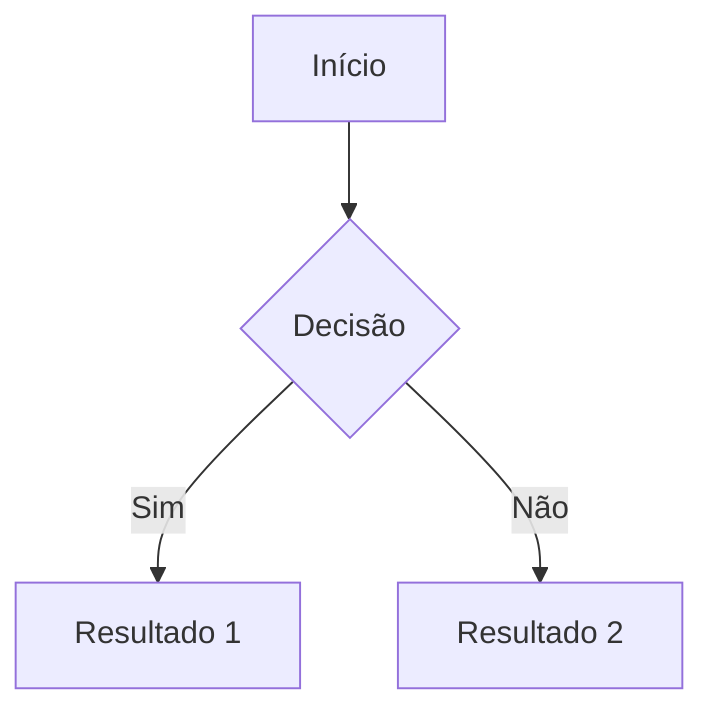
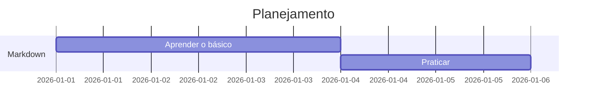

# Guia Prático e Definitivo de Markdown 🧠✨

Markdown é aquele superpoder discreto: você aprende rápido, usa pra sempre e ainda parece um hacker educado escrevendo documentação bonita.

Este guia transforma anotações soltas em **material didático organizado**, indo do básico ao avançado — com exemplos copiáveis.

---

## O que é Markdown?

Markdown é uma linguagem de marcação **simples**, criada para escrever textos formatados usando apenas caracteres comuns do teclado. O objetivo é um só:

> **Legibilidade primeiro.** Mesmo sem renderizar, o texto continua humano.

Arquivos Markdown normalmente usam a extensão `.md`.

---

## 1. Títulos e Estrutura

```markdown
# Título Principal (H1)
## Subtítulo (H2)
### Seção (H3)
#### Subseção (H4)
```

Use títulos para estruturar o documento. Pense neles como o esqueleto do texto.

---

## 2. Formatação de Texto

```markdown
**Negrito**
*Itálico*
~~Riscado~~
`Código inline`
```

Resultado:
- **Negrito**
- *Itálico*
- ~~Riscado~~
- `Código inline`

---

## 3. Listas

### Lista não ordenada

```markdown
- Item A
- Item B
  - Subitem
```

### Lista numerada

```markdown
1. Primeiro passo
2. Segundo passo
```

### Checklist (lista de tarefas)

```markdown
- [x] Feito
- [ ] A fazer
```

---

## 4. Links e Imagens

```markdown
[Texto do link](https://exemplo.com)


```

Dica: o texto alternativo da imagem é importante para acessibilidade.

---

## 5. Citações

```markdown
> Isso aqui é uma citação sábia.
```

Resultado:
> Isso aqui é uma citação sábia.

---

## 6. Blocos de Código

Use três crases e informe a linguagem para ganhar syntax highlight.

```markdown
```python
def saudacao():
    print("Olá, mundo!")
```
```

---

## 7. Tabelas

```markdown
| Nome  | Idade | Profissão |
|------|-------|-----------|
| Alice| 25    | Dev       |
| Bob  | 30    | Designer  |
```

Dica ninja:
- `:---` alinha à esquerda
- `:---:` centraliza
- `---:` alinha à direita

---

## 8. Notas de Rodapé

```markdown
Isso é uma afirmação importante[^1].

[^1]: Fonte extremamente confiável.
```

---

## 9. Markdown + HTML (Modo Overclock)

Markdown aceita HTML embutido quando você precisa de algo mais específico.

```markdown
<p align="center">Texto centralizado</p>

<details>
<summary>Clique para revelar</summary>
Surpresa! 🎉
</details>
```

---

## 10. Fórmulas Matemáticas (LaTeX)

Suportado em editores modernos como Obsidian, VS Code e GitHub.

### Fórmula inline

```markdown
A famosa equação $E = mc^2$ mudou tudo.
```

### Bloco de fórmula

```markdown
$$x = \frac{-b \pm \sqrt{b^2 - 4ac}}{2a}$$
```

### Matrizes

```markdown
$$
\begin{matrix}
1 & 0 & 0 \\
0 & 1 & 0 \\
0 & 0 & 1
\end{matrix}
$$
```

---

## 11. Diagramas com Mermaid 🧩

Mermaid permite criar diagramas usando texto puro.

### Fluxograma



### Gráfico de Gantt



---

## 12. Âncoras e Navegação Interna

```markdown
[Ir para a conclusão](#conclusão)

## Conclusão
```

---

## Filosofia do Markdown

Markdown não tenta fazer tudo.

Ele prefere ser:
- Simples
- Legível
- Portável

Se você precisa de algo mais poderoso, entra em cena:
- **Editores** (Obsidian, VS Code)
- **Conversores** (Pandoc)
- **Geradores de site** (Hugo, Jekyll)

---

## Onde praticar

- **Online:** StackEdit, Dillinger
- **Offline:** Obsidian (ótimo para notas interligadas)
- **Dev mode:** VS Code + extensões de Markdown

---

## Conclusão 🎯

Markdown é o canivete suíço da documentação. Simples por fora, poderoso por dentro.

Se você escreve texto técnico, estuda, documenta código ou organiza ideias — Markdown vira extensão do seu cérebro.

Use sem moderação. 😄

