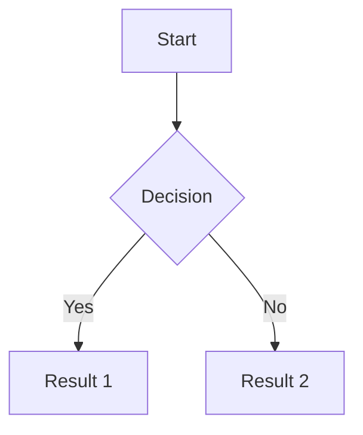
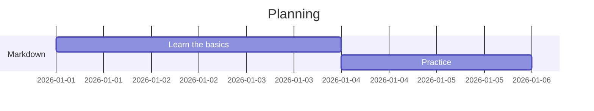

# The Practical and Definitive Markdown Guide 🧠✨

Markdown is that quiet superpower: you learn it fast, use it forever, and still look like a well-mannered hacker writing beautiful documentation.

This guide turns loose notes into **organized learning material** — from the basics to advanced tricks — with copyable examples.

---

## What is Markdown?

Markdown is a **simple** markup language created for writing formatted text using only common keyboard characters. It has one goal:

> **Readability first.** Even unrendered, the text stays human.

Markdown files typically use the `.md` extension.

---

## 1. Headings and Structure

```markdown
# Main Title (H1)
## Subtitle (H2)
### Section (H3)
#### Subsection (H4)
```

Use headings to structure the document. Think of them as the skeleton of the text.

---

## 2. Text Formatting

```markdown
**Bold**
*Italic*
~~Strikethrough~~
`Inline code`
```

Result:
- **Bold**
- *Italic*
- ~~Strikethrough~~
- `Inline code`

---

## 3. Lists

### Unordered list

```markdown
- Item A
- Item B
  - Subitem
```

### Numbered list

```markdown
1. First step
2. Second step
```

### Checklist (task list)

```markdown
- [x] Done
- [ ] To do
```

---

## 4. Links and Images

```markdown
[Link text](https://example.com)


```

Tip: an image's alt text matters for accessibility.

---

## 5. Quotes

```markdown
> This is a wise quote.
```

Result:
> This is a wise quote.

---

## 6. Code Blocks

Use three backticks and specify the language to get syntax highlighting.

```markdown
```python
def greet():
    print("Hello, world!")
```
```

---

## 7. Tables

```markdown
| Name  | Age | Job       |
|-------|-----|-----------|
| Alice | 25  | Dev       |
| Bob   | 30  | Designer  |
```

Ninja tip:
- `:---` aligns left
- `:---:` centers
- `---:` aligns right

---

## 8. Footnotes

```markdown
This is an important statement[^1].

[^1]: Extremely reliable source.
```

---

## 9. Markdown + HTML (Overclock Mode)

Markdown accepts embedded HTML when you need something more specific.

```markdown
<p align="center">Centered text</p>

<details>
<summary>Click to reveal</summary>
Surprise! 🎉
</details>
```

---

## 10. Math Formulas (LaTeX)

Supported in modern editors like Obsidian, VS Code, and GitHub.

### Inline formula

```markdown
The famous equation $E = mc^2$ changed everything.
```

### Formula block

```markdown
$$x = \frac{-b \pm \sqrt{b^2 - 4ac}}{2a}$$
```

### Matrices

```markdown
$$
\begin{matrix}
1 & 0 & 0 \\
0 & 1 & 0 \\
0 & 0 & 1
\end{matrix}
$$
```

---

## 11. Diagrams with Mermaid 🧩

Mermaid lets you create diagrams using plain text.

### Flowchart



### Gantt Chart



---

## 12. Anchors and Internal Navigation

```markdown
[Go to conclusion](#conclusion)

## Conclusion
```

---

## Markdown's Philosophy

Markdown doesn't try to do everything.

It prefers to be:
- Simple
- Readable
- Portable

If you need something more powerful, enter:
- **Editors** (Obsidian, VS Code)
- **Converters** (Pandoc)
- **Site generators** (Hugo, Jekyll)

---

## Where to Practice

- **Online:** StackEdit, Dillinger
- **Offline:** Obsidian (great for linked notes)
- **Dev mode:** VS Code + Markdown extensions

---

## Conclusion 🎯

Markdown is the Swiss Army knife of documentation. Simple on the outside, powerful on the inside.

If you write technical text, study, document code, or organize ideas — Markdown becomes an extension of your brain.

Use it without moderation. 😄
